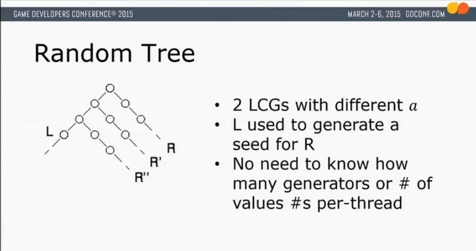

Linear Congruential Generator
===

A super simple random number generator which generates trees. This doesn't need its own package (it's like 50 lines of code), I'm just making this to refresh my memory on npm/github workflows.

A linear congruential generator (LCG) is a random number generator that works like:

`pseudorandom = (pseudorandom * magic_number_1+magic_number_2) % magic_number_3`

An LCG tree allows you to easily seed a new LCG from your existing LCG. The use case where I first heard about this was in a GDC talk 
about [parallel generation of pseudorandom numbers](https://www.youtube.com/watch?v=qO8FAQvlgX0). Eg if you want to generate 10^12 random 
numbers, you can first generate 10^6 random numbers with a single LCG (with one set of magic numbers), 
then you treat each of those as seeds for 10^6 new LCGs (with a second set of magic numbers). Now each of those can generate 10^6 numbers
in parallel, independently.

My use case is an application to my SmartText generation project. I have a randomly generated story with a tree structure, so the text
`{He,She} {ran,walked} to the {store,house}` will be randomly turned into "He walked to the store" or "She ran to the house" or the other six possibilities.
I want to be able to add more random adjectives without changing later paragraphs. 

For example, suppose the sentence generated was "He ran to the store". Suppose I then change my input to
`{He,She} {ran {quickly,jauntily},walked} to the {store,house}`, a linear generator would still pick "He", then "ran", 
but the further text or proceeding paragraphs would be completely re-randomized. This isn't just annoying, it's an eyesore 
to see the text that you aren't editing being completely re-randomized. With a random tree, the 0th level choices ("He", "ran ...", and "store") 
are all chosen by one LCG, and the choice between "quickly" or "jauntily" is handled by a new LCG.

Unfortunately, inserting a new random choice will still randomize all further paragraphs. So if the user wanted to change it to
`{He,She} {quickly,jauntily} {ran,walked} to the {store,house}`, everything past the new insertion would be randomized again.

There are a few solutions to this. One would be the following, which isn't supported in the current SmartText syntax (`{{x,y}}` gets simplified to `{x,y}`).

`{He,She} {}{ran,walked} to the {store,house}` -> `{He,She} {{quickly,jauntily}} {ran,walked} to the {store,house}` 

A partial solution is to set the "random_on_branch" option to false. I don't think there's any fix that can be done on the tree side of things, 
I think it's all going to be in the SmartText syntax.

